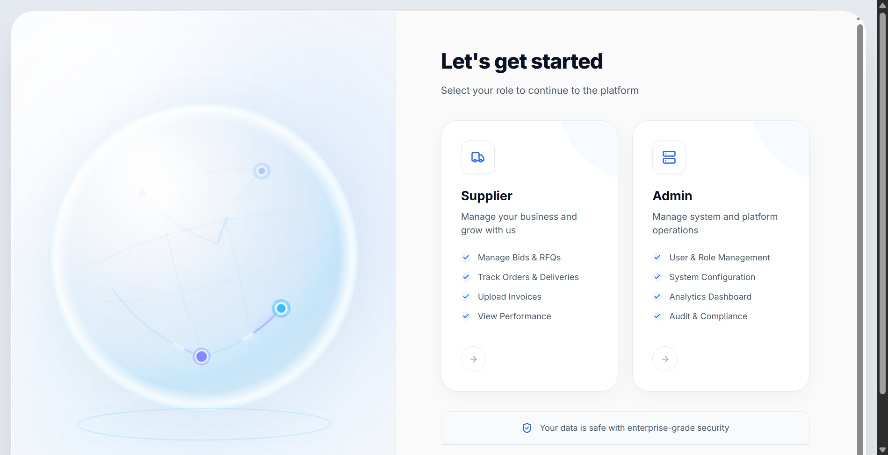
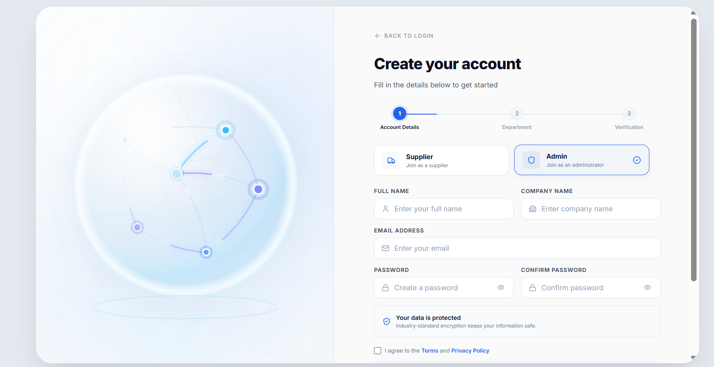
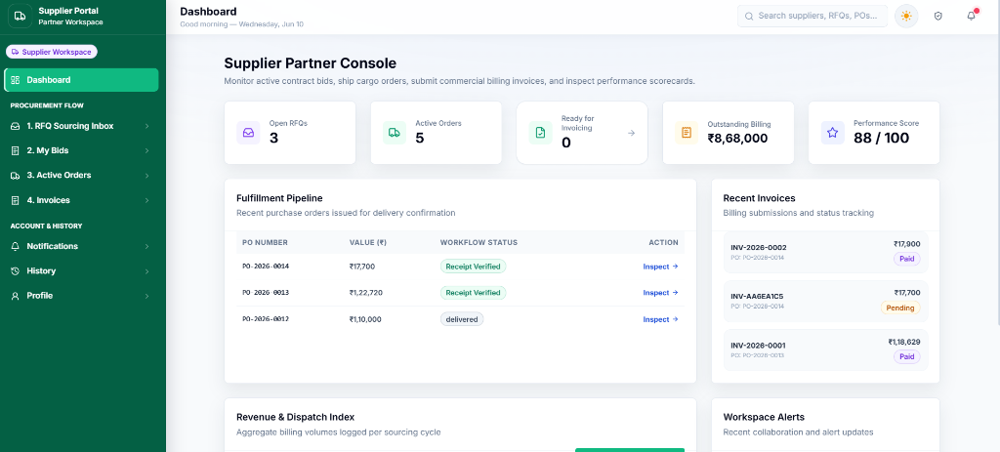
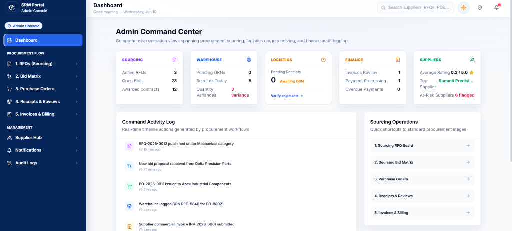
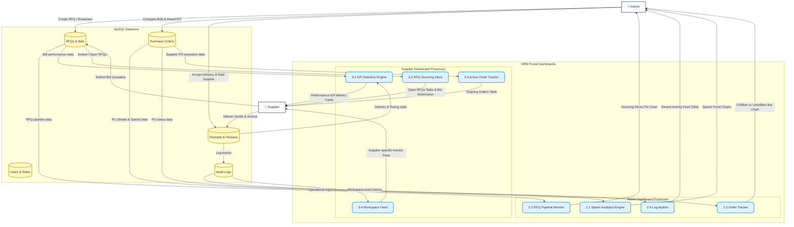

<div align="center">

# 🌐 Supplier Relationship Management (SRM) Portal

**Enterprise-Grade Procurement & Supplier Collaboration Platform**

[](https://reactjs.org/)
[](https://vitejs.dev/)
[](https://tailwindcss.com/)
[](https://www.framer.com/motion/)
[](https://www.php.net/)
[](https://www.mysql.com/)

A state-of-the-art procurement lifecycle platform connecting **Suppliers** and **Administrators** through a unified, role-based interface. Built with rich glassmorphism aesthetics, fluid micro-animations, and real-time cross-tab notifications — modeled after industry solutions like SAP Ariba, Coupa, and Oracle Procurement.

</div>

---

## 📑 Table of Contents

- [User Interface](#-immersive-user-interface)
- [System Architecture (DFD)](#-system-architecture--data-flow)
- [Key Modules & Features](#-key-modules--features)
- [PDF Parsing Engine](#-client-side-pdf-parsing-engine)
- [Security & Vulnerability Auditing](#️-security--vulnerability-auditing)
- [Repository Structure](#-repository-structure)
- [Setup & Installation](#️-setup--installation)
- [Testing & Route Bypass Guides](#-testing--route-bypass-guides)
- [10-Stage Procurement Flow](#-10-stage-consolidated-sourcing--billing-flow)
- [Tech Stack](#-tech-stack)
- [Documentation](#-documentation)
- [License](#-license)

---

## 🎨 Immersive User Interface

The portal utilizes a cutting-edge **split-pane glassmorphism design system** featuring vibrant, high-fidelity HSL gradients, organic light-fog glow effects, and complex SVG/motion-driven visualizations.

| Role Selection | Register Wizard |
| :---: | :---: |
|  |  |

| Supplier Login | Admin Login |
| :---: | :---: |
|  |  |

| Supplier Console Dashboard | Admin Command Center |
| :---: | :---: |
|  |  |

---

## 📊 System Architecture & Data Flow

The Level-1 Data Flow Diagram below illustrates how information moves between the two user roles (Admin, Supplier), the portal's dashboard engine processes, and the MySQL data stores:



---

## 🚀 Key Modules & Features

### 1. 🔐 Role-Based Authentication System

- **Dual Entry Gateways** — Fully styled custom entry portals for Suppliers and Admins.
- **Iridescent Globe Visualization** — Dynamic SVG globe animating interactive nodes and connection pulse lines on the presentation pane.
- **Transition Animations** — Powered by Framer Motion for springy role switches, interactive hover states, card lifting, and floating transitions.
- **Guided Registration** — A 3-step wizard collecting account details, business/department information, and verification in sequence.
- **Tab Independence** — Uses `sessionStorage` to isolate user sessions per browser tab, enabling simultaneous admin and supplier testing without session conflicts.

### 2. 🛡️ Admin Portal — Procurement Control Center

Provides administrators with complete control and visibility over the supply chain:

| Module | Description |
| --- | --- |
| **Dashboard** | Real-time analytical breakdown of supplier participation, purchase commitments, and average RFQ cycle times. |
| **RFQ Sourcing** | Dynamic forms to author and broadcast RFQs. Auto-fills fields by parsing uploaded PDF specs side-by-side. |
| **Bid Comparison** | Interactive Recharts visualizations comparing multiple supplier bids per RFQ on price and quality metrics. |
| **Purchase Orders** | Manage PO pipelines, track order status, and issue agreements. |
| **Receipts & GRN** | Record Goods Receipt Notes to check quantities and inspect deliveries with a multi-item grid parsed from delivery receipts. |
| **Invoice Workbench** | Review invoices, execute 3-way match (PO vs. GRN vs. Invoice), and record payouts. |
| **Governance & Audit** | Monitor system logs and inspect chronological action trails for security compliance. |

### 3. 🚚 Supplier Portal — Partner Workspace

Empowers suppliers to manage quotations, products, and fulfillment:

| Module | Description |
| --- | --- |
| **Dashboard** | View active bids, delivery rates, and performance statistics. |
| **RFQ Sourcing Inbox** | Search, filter, and bid directly on open Requests for Quotations. |
| **Product Catalog** | List, edit, and manage supplier items with unique SKU tracking. |
| **Order & Delivery Tracker** | Live statuses of ongoing purchase orders, shipments, and invoice histories. |
| **KPI & Performance** | Real-time ratings and scorecards evaluating delivery, pricing, and quality. |
| **Compliance Uploads** | Upload ISO Certificates or W-9 tax forms with automatic expiry-date parsing. |

### 4. 🔔 Real-Time Toast Notification System

- **Animated Entries & Exits** — Premium sliding/fading card animations powered by Framer Motion.
- **Dynamic Categorization** — Context-aware color palettes, typography, and iconography for Sourcing (RFQs, Bids), Orders (POs, GRNs), and Negotiations (Messages, counter-offers).
- **Auto-Dismissal** — Automatically fades out in 5 seconds with click-to-dismiss and interactive hover states.
- **Cross-Tab Synchronization** — Uses `localStorage` change tracking and browser `storage` events to broadcast alerts instantly across multiple open tabs.
- **One-Click Deep Linking** — Clicking a toast marks the notification as read and routes the user directly to the relevant page.

---

## ⚡ Client-Side PDF Parsing Engine

The portal eliminates manual data entry by extracting metadata from business documents entirely within the user's browser — no data leaves the client.

```
[PDF Uploaded] ──> [Dynamic CDN Loader (pdf.js)] ──> [Text Extraction] ──> [Regex Parsers] ──> [Form Auto-Fill]
```

### Supported Document Types

| Parser | Input | Extracted Fields |
| --- | --- | --- |
| `parseRfqPdf` | RFQ Specification | Title, category, deadline, estimated budget |
| `parseBidPdf` | Bid Quotation | Reference, warranty, delivery time, total price |
| `parseGrnPdf` | Delivery Receipt | Multi-row item quantities (Delivered / Accepted) |
| `parseInvoicePdf` | Commercial Invoice | Invoice ID, PO number, invoice amount |
| `parseCompliancePdf` | Compliance Document | Certification ID, expiry date, issuer, document type |

### Adaptive Modal Layout

- **Standard View** (no PDF) — Modals open centered at standard width (`lg` / `xl`).
- **Split-Screen View** (with PDF) — Modals expand to `max-w-7xl` (1280 px). Left pane renders editable auto-filled fields; right pane renders an interactive PDF preview `iframe` for verification.

---

## 🛡️ Security & Vulnerability Auditing

The portal is audited and patched against common enterprise vulnerabilities:

- **SQL Injection Prevention** — All PHP REST APIs use MySQLi prepared statements with strictly bound literal parameters.
- **Password Security** — Passwords stored using **bcrypt** hashing (`PASSWORD_DEFAULT`).
- **In-Browser Document Privacy** — PDF extraction occurs entirely in-memory; no document binary or parsed text is transmitted to external APIs.
- **Parameter Binding Patches**:
  - `bids.php` — Remediated a parameter count mismatch (14 type specifiers for 13 variables).
  - `receipts.php` — Resolved scrambled type mappings binding string fields to integer parameters.
  - `invoices.php` — Corrected date parameter double-casting causing dates to truncate to `2026-00-00`.

---

## 📁 Repository Structure

```
SRM_PROJECT/
├── docs/                         # Consolidated project documentation
│   ├── testing-guide.md          # 11-step end-to-end user testing guide
│   ├── portal-workflow.md        # Business workflow & procurement lifecycle
│   ├── pdf-parsing-logic.md      # Client-side PDF extraction & regex parsing
│   └── security-audit-report.md  # SQLi prevention & parameter binding audit
├── src/
│   ├── components/               # Reusable UI blocks (Alert, Modal, Sidebar, Navbar, StatCards)
│   │   └── ui/                   # Visual primitives (GridBackground, BackgroundBeams, Meteors)
│   ├── layouts/                  # Layout wrappers (AdminLayout, SupplierLayout, PublicLayout)
│   ├── pages/
│   │   ├── auth/                 # LoginPage, RegisterPage, ForgotPassword
│   │   ├── admin/                # Dashboard, RFQManagement, BidComparison, Analytics, AuditLogs
│   │   └── supplier/             # Dashboard, MyBids, Products, RFQs, Invoices, KpiPerformance
│   ├── routes/                   # React Router configuration (appRoutes.jsx)
│   ├── utils/                    # Helpers, formatters, pdfParser.js
│   ├── main.jsx                  # App entry point (HashRouter)
│   └── styles.css                # Tailwind config, glassmorphism tokens, animations
├── backend/
│   ├── api/                      # PHP REST endpoints (login, register, bids, rfqs, etc.)
│   ├── config/                   # Database configuration (db.php)
│   └── database/                 # schema.sql & migrate.php
├── public/
│   ├── images/                   # High-resolution screenshots & illustrations
│   └── samples/                  # Test PDFs (rfq-procurement-spec.pdf, bid-quotation.pdf, etc.)
├── tailwind.config.js            # Tailwind configuration with dark-mode overrides
├── vite.config.js                # Vite build & proxy settings
└── package.json                  # Dependencies & build scripts
```

---

## 🛠️ Setup & Installation

### Prerequisites

- [Node.js](https://nodejs.org/) ≥ 18
- [PHP](https://www.php.net/) ≥ 8.0
- [MySQL](https://www.mysql.com/) ≥ 8.0 (or MariaDB equivalent)
- [XAMPP](https://www.apachefriends.org/) (recommended for local development)

### 1. Database Setup

Ensure MySQL/Apache is running (e.g., via XAMPP). Set up the database schema and apply all required migrations:

```bash
# Step A: Create the base database schema and seed initial tables
mysql -u root < SRM_PROJECT/backend/database/schema.sql

# Step B: Run all incremental migrations to update tables and seed mock supplier profiles/evaluations
cd SRM_PROJECT/backend/database
php migrate_all.php
```

This creates the `srm_portal` database, establishes InnoDB constraints, applies necessary columns for PO tracking/3-way matching, and seeds the 16 mock supplier partner accounts along with their default performance evaluations.

### 2. Environment Configuration

**Backend** — `backend/config/db.php` reads connection variables from the environment:

| Variable | Default |
| --- | --- |
| `DB_HOST` | `127.0.0.1` |
| `DB_USER` | `root` |
| `DB_PASS` | *(empty)* |
| `DB_NAME` | `srm_portal` |

**Frontend** — Create or edit `SRM_PROJECT/.env`:

```env
VITE_API_BASE_URL=http://127.0.0.1/SUPPLIER-RELATIONSHIP-MANAGEMENT/SRM_PROJECT/backend/api
```

### 3. Frontend Setup

```bash
cd SRM_PROJECT
npm install
npm run dev
```

Open the URL shown in the terminal (typically **http://localhost:5173**).

---

## 🧪 Testing & Route Bypass Guides

### Default Test Accounts

| Role | Email | Password |
| --- | --- | --- |
| Admin | `admin@srm.local` | `password123` |
| Supplier | `supplier@srm.local` | `password123` |

### Development Hash Routes (Bypass Login)

For quick UI inspection and manual validation, navigate directly to any of these routes:

| Page | URL |
| --- | --- |
| Admin Dashboard | `http://localhost:5173/#/admin` |
| Spend Analytics | `http://localhost:5173/#/admin/analytics` |
| Audit Logs | `http://localhost:5173/#/admin/audit-logs` |
| Supplier Dashboard | `http://localhost:5173/#/supplier` |
| RFQ Sourcing Inbox | `http://localhost:5173/#/supplier/rfqs` |
| KPI & Performance | `http://localhost:5173/#/supplier/performance` |

---

## 📝 10-Stage Consolidated Sourcing & Billing Flow

Follow these steps sequentially to exercise the full automated Procurement Lifecycle. For complete instructions, see the [Step-by-Step Testing Guide](SRM_PROJECT/docs/testing-guide.md).

| Stage | Actor | Action |
| :---: | --- | --- |
| 1 | Supplier | **Registration & Catalog** — Manage unique SKU catalogs under Partner Workspace. |
| 2 | Admin | **Create RFQ** — Auto-populate sourcing details by parsing `rfq-procurement-spec.pdf`. |
| 3 | Supplier | **Submit Bid** — Respond to RFQ invitations and submit quote proposals. |
| 4 | Both | **Evaluate & Negotiate** — Compare competing quotes; enter the Negotiation Room for counter-offers. |
| 5 | Admin | **Issue Purchase Order** — Award the contract to generate a legally binding PO. |
| 6 | Admin | **Goods Receipt (GRN)** — Log deliveries using `delivery-receipt.pdf` to record accepted quantities. |
| 7 | Supplier | **Invoice Submission** — Upload `supplier-invoice.pdf` to record invoice details. |
| 8 | Admin | **3-Way Match** — Run automated PO vs. GRN vs. Invoice verification. |
| 9 | Admin | **Payment Processing** — Approve matching invoices and transition to `Paid`. |
| 10 | Both | **Compliance & Audit** — Maintain certifications and review operational audit trails. |

---

## 🔧 Tech Stack

| Layer | Technology |
| --- | --- |
| **Frontend Framework** | React 18 + Vite |
| **Styling** | Tailwind CSS 3, custom glassmorphism tokens |
| **Animations** | Framer Motion |
| **Charting** | Recharts |
| **PDF Parsing** | pdf.js (CDN, client-side) |
| **Backend** | PHP 8 (REST API) |
| **Database** | MySQL 8 / MariaDB |
| **Auth** | bcrypt hashing, session-per-tab isolation |
| **Dev Environment** | XAMPP, Node.js |

---

## 📚 Documentation

All project documentation is consolidated under [`SRM_PROJECT/docs/`](SRM_PROJECT/docs/):

| Document | Description |
| --- | --- |
| [testing-guide.md](SRM_PROJECT/docs/testing-guide.md) | 11-step end-to-end user testing walkthrough |
| [portal-workflow.md](SRM_PROJECT/docs/portal-workflow.md) | Business workflow & procurement lifecycle guide |
| [pdf-parsing-logic.md](SRM_PROJECT/docs/pdf-parsing-logic.md) | Client-side PDF extraction & regex parsing details |
| [security-audit-report.md](SRM_PROJECT/docs/security-audit-report.md) | SQL injection prevention & parameter binding audit |

---

## 📝 License

This project is proprietary study/internship source material. All rights reserved.

---

<div align="center">
  <sub>Built with ❤️ using React, Vite, Tailwind CSS, Framer Motion, PHP & MySQL</sub>
</div>
