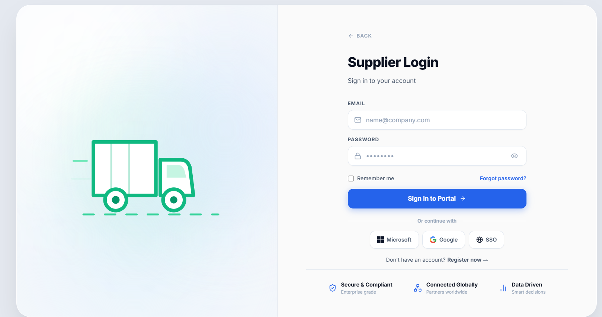
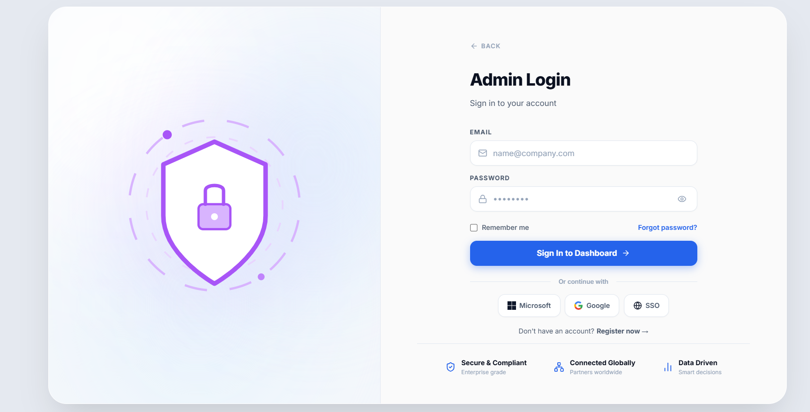

# 🌐 Supplier Relationship Management (SRM) Portal

[](https://reactjs.org/)
[](https://vitejs.dev/)
[](https://tailwindcss.com/)
[](https://www.framer.com/motion/)

Welcome to the **Supplier Relationship Management (SRM) Portal**, a state-of-the-art enterprise procurement and supplier collaboration platform. Built with a focus on rich aesthetics, sleek glassmorphism, responsive role-based access, and fluid micro-animations, this web application connects **Suppliers** and **Administrators** seamlessly through a unified interface.

---

## 🎨 Immersive User Interface

The portal utilizes a cutting-edge **split-pane glassmorphism design system** featuring vibrant, high-fidelity HSL gradients, organic light-fog glow effects, and complex SVG/motion-driven visualizations.

### Let's Get Started Landing Page
Here is the high-fidelity role-based landing page, allowing users to choose their appropriate portal:





---

## 🚀 Key Modules & Features

### 1. 🔐 Role-Based Authentication System
*   **Dual Entry Gateways**: Fully styled custom entry portals for **Suppliers** and **Admins**.
*   **Iridescent Globe Visualization**: An elegant, dynamic SVG globe animating interactive nodes and connection pulse lines on the presentation pane.
*   **Transition Magic**: Powered by **Framer Motion** for springy role switches, interactive hover states, card lifting, and floating transitions.
*   **Security Built-in**: Enterprise-grade secure input styling, "Remember Me" sessions, and Forgot Password recovery flows.

### 2. 🚛 Supplier Portal
A dedicated dashboard that empowers suppliers with end-to-end management of their business:
*   **Performance Metrics Dashboard**: Key performance indicator cards for active bids, delivery rates, and revenue charts using Recharts.
*   **Interactive RFQs Panel**: Search, filter, and bid directly on open Requests for Quotations.
*   **Order & Delivery Tracker**: Live statuses of ongoing purchase orders and shipments.
*   **Product Catalog Management**: Easily upload, edit, and keep track of supplier items.

### 3. 🛡️ Admin Portal
A comprehensive control center for system administrators to oversee and optimize procurement:
*   **Global Overview**: Analytical breakdown of total supplier participation, purchase commitments, and average RFQ cycle times.
*   **Advanced Bid Comparison**: Interactive charts comparing multiple supplier bids per RFQ side-by-side to determine the best price and quality metrics.
*   **Supplier Directory**: Complete directory to evaluate supplier ratings, view historical reviews, and perform operational audits.
*   **RFQ Generation System**: Dynamic forms to author and broadcast RFQs instantly.

---

## 🛠️ Technology Stack

*   **Core Library**: [React.js](https://react.dev/) (v18+)
*   **Build Tool**: [Vite](https://vite.dev/) (ultra-fast compilation and HMR)
*   **CSS Engine**: [Tailwind CSS](https://tailwindcss.com/) (utility-first, augmented with customized HSL variables)
*   **Animation Engine**: [Framer Motion](https://www.framer.com/motion/) (complex orchestrations & exit/entrance layouts)
*   **Icons**: [Lucide React](https://lucide.dev/) (clean, responsive stroke icons)
*   **Visual Charts**: [Recharts](https://recharts.org/) (composed React charts built on SVG)

---

## 📁 Repository Structure

```directory
SRM_PROJECT/
├── src/
│   ├── components/       # Reusable UI Blocks (Alert, Button, Modal, Sidebar, Navbar, StatCards)
│   ├── layouts/          # Layout wrappers (AdminLayout, SupplierLayout, PublicLayout)
│   ├── pages/
│   │   ├── auth/         # LoginPage, RegisterPage, ForgotPassword, AnimatedAuthSVGs
│   │   ├── admin/        # Dashboard, RFQManagement, BidComparison, SupplierManagement
│   │   └── supplier/     # Dashboard, MyBids, Profile, Products, RFQs, Reviews
│   ├── routes/           # Declarative React Router configurations
│   ├── styles.css        # Tailwind config, glassmorphism tokens, and custom animation definitions
│   └── main.jsx          # App entry point
├── public/
│   └── images/           # High-resolution illustrative backgrounds & screenshots
└── package.json          # Project dependencies & build scripts
```

---

## ⚙️ Setup and Installation

Follow these steps to run the development server locally:

### 1. Prerequisite
Ensure you have [Node.js](https://nodejs.org/) (version 16 or higher) installed on your system.

### 2. Install Dependencies
Navigate into the project directory and install the necessary package dependencies:
```bash
cd SRM_PROJECT
npm install
```

### 3. Launch Development Server
Boot up the local dev server using Vite:
```bash
npm run dev
```
Open your browser and navigate to the port output in your terminal (typically **`http://localhost:5173`**).

---

## 📝 License
This project is proprietary study/internship source material. All rights reserved.
