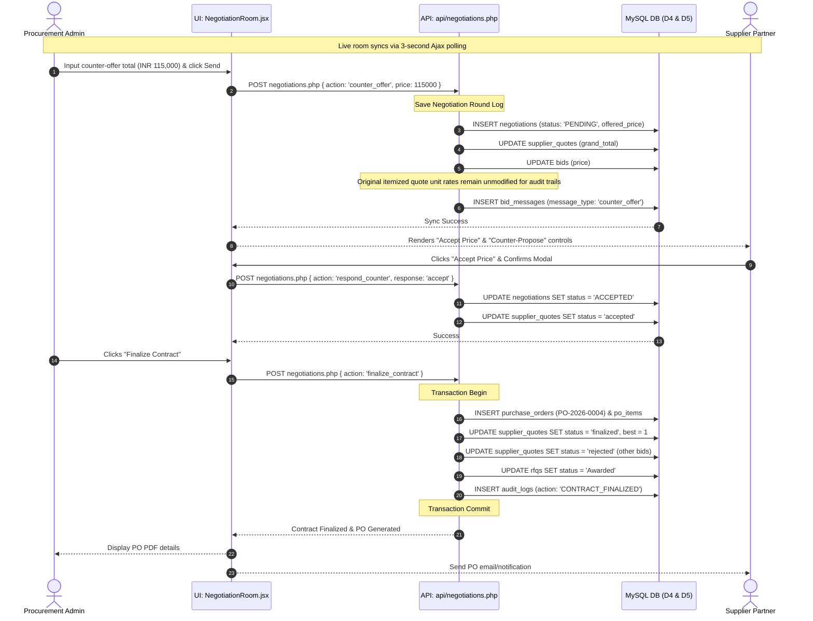

# 📊 Data Flow Diagram (DFD) Specifications
## Supplier Relationship Management (SRM) Portal

This document provides a highly detailed architectural overview and specification of the **Data Flow Diagram (DFD)** for the Supplier Relationship Management (SRM) Portal. The SRM Portal automates the sourcing, negotiation, warehouse receiving, and finance settlement pipeline by using client-side PDF parsing and structured database controls.

---

## 👥 1. External Entities (System Actors)

The system boundaries interface with two primary classes of external entities, each divided into distinct business roles:

| External Entity | Real-World Business Persona | Key System Interactions |
| :--- | :--- | :--- |
| **Procurement Administrator** | **Procurement Manager** | Uploads sourcing spec PDFs, drafts and opens RFQs, configures categories. |
| | **Sourcing Lead** | Evaluates bids, enters the negotiation room, sends price counters, finalizes contracts. |
| | **Warehouse Supervisor** | Uploads logistics receipts, conducts physical inspections, logs Goods Receipt Notes (GRN). |
| | **Finance Manager** | Audits transaction logs, reviews the 3-Way Match Workbench, triggers payouts. |
| **Supplier Partner** | **Commercial Lead** | Creates catalogs, uploads proposal PDFs, submits bids, negotiates pricing. |
| | **Billing Clerk** | Generates commercial invoices, uploads invoice PDFs, checks settlement statuses. |
| | **Compliance Auditor** | Uploads ISO/GST tax compliance certificates, updates profile metadata. |

---

## 🗄️ 2. Data Stores Mapping (Database Entities)

The system relies on 12 physical database tables (structured in [schema.sql](file:///c:/xampp/htdocs/SUPPLIER-RELATIONSHIP-MANAGEMENT/SRM_PROJECT/backend/database/schema.sql)) that act as persistent data stores:

*   **`D1: Users Store` (`users`)**: Authenticated identities, passwords, roles (`admin` or `supplier`), and verification codes.
*   **`D2: Supplier Profiles Store` (`suppliers`)**: Supplier registration records, GST numbers, contact info, and aggregate performance scores.
*   **`D3: RFQ Store` (`rfqs`, `rfq_items`)**: Sourcing specifications, quantities, target budgets, deadlines, and itemized specifications.
*   **`D4: Bids & Quotes Store` (`bids`, `supplier_quotes`, `supplier_quote_items`, `supplier_quote_documents`)**: Supplier quote records, subtotal, tax, freight, line-item details, and uploaded binary attachments.
*   **`D5: Purchase Orders Store` (`purchase_orders`, `po_items`)**: Legally binding purchase contracts, line-item totals, and legal terms agreed upon finalization.
*   **`D6: Products Catalog` (`products`, `categories`)**: Supplier product listings, unit pricing, descriptions, and stock quantities.
*   **`D7: Goods Receipts Store` (`goods_receipts`)**: Inspection receipts logging received vs. accepted counts, damaged quantities, and inspector remarks.
*   **`D8: Invoices Store` (`invoices`)**: Commercial invoices submitted by suppliers, due dates, billing amounts, and payment statuses.
*   **`D9: Compliance Documents Store` (`compliance_documents`)**: ISO certifications, tax filings, expiry dates, issuers, and file paths.
*   **`D10: Messages & Alerts` (`notifications`, `workspace_messages`, `bid_messages`)**: Real-time notifications, sourcing chats, and negotiation-room messages.
*   **`D11: Audit Trail Store` (`audit_logs`)**: Chronological logs of user actions, IP addresses, transaction values, and metadata for security compliance.
*   **`D12: Analytics Warehouse` (`spend_analytics_snapshots`)**: Monthly snapshots containing total spend aggregates, active supplier counts, and processed RFQ cycle counts.

---

## 🗺️ 3. Level 0: Context Data Flow Diagram

The Context Diagram defines the system boundary, mapping inputs and outputs passing between external actors and the SRM Portal.

```mermaid
graph TD
    %% Styling Configuration
    classDef actor fill:#e0f2fe,stroke:#0284c7,stroke-width:2px,color:#0f172a;
    classDef system fill:#fef3c7,stroke:#d97706,stroke-width:3px,color:#451a03;

    %% Nodes
    Admin["Procurement Administrator<br/>(Procurement, Sourcing, Warehouse, Finance)"]:::actor
    Supplier["Supplier Partner<br/>(Commercial, Billing, Compliance)"]:::actor
    SRM("0.0 Supplier Relationship Management Portal<br/>(Central Processing Engine)"):::system

    %% Admin Data Flows
    Admin -->|1. Sourcing Specs PDF & RFQ Details| SRM
    Admin -->|2. Price Counters & Acceptance| SRM
    Admin -->|3. Logistics Receipts & Inspection Quantities| SRM
    Admin -->|4. Payment Approval & Wire Info| SRM
    
    SRM -->|1. Spend Analytics & Audit Log Views| Admin
    SRM -->|2. Bid Comparison Matrix & Quotations| Admin
    SRM -->|3. Supplier Compliance Warnings| Admin
    SRM -->|4. 3-Way Matching Invoices Workbench| Admin

    %% Supplier Data Flows
    Supplier -->|1. Registration & Catalog Items| SRM
    Supplier -->|2. Proposal PDF & Bid Values| SRM
    Supplier -->|3. Price Counter-Offers & Chat| SRM
    Supplier -->|4. Commercial Invoice PDF & GST Details| SRM
    Supplier -->|5. Compliance Certificates (ISO/W-9)| SRM

    SRM -->|1. Published RFQ Notifications| Supplier
    SRM -->|2. Performance Ratings & Scorecard| Supplier
    SRM -->|3. Negotiation Requests & Chat| Supplier
    SRM -->|4. Legally Binding Purchase Orders (PO)| Supplier
    SRM -->|5. Payout & Remittance Statuses| Supplier
```

---

## ⛓️ 4. Level 1: Process-Level Data Flow Diagram

The Level 1 DFD decomposes the system into seven primary processes, mapping how data moves between inputs, outputs, processes, and persistent data stores.

```mermaid
graph TD
    %% Styling Configuration
    classDef actor fill:#e0f2fe,stroke:#0284c7,stroke-width:2px,color:#0f172a;
    classDef process fill:#fef3c7,stroke:#d97706,stroke-width:2px,color:#451a03;
    classDef store fill:#dcfce7,stroke:#16a34a,stroke-width:2px,color:#064e3b;

    %% Entities
    Admin["Procurement Admin"]:::actor
    Supplier["Supplier Partner"]:::actor

    %% Data Stores
    D1[("D1: Users Store")]:::store
    D2[("D2: Supplier Profiles")]:::store
    D3[("D3: RFQ Store")]:::store
    D4[("D4: Bids & Quotes")]:::store
    D5[("D5: Purchase Orders")]:::store
    D6[("D6: Products Catalog")]:::store
    D7[("D7: Goods Receipts")]:::store
    D8[("D8: Invoices Store")]:::store
    D9[("D9: Compliance Docs")]:::store
    D10[("D10: Messages & Alerts")]:::store
    D11[("D11: Audit Trail")]:::store
    D12[("D12: Spend Analytics")]:::store

    %% Processes
    P1["1.0 Supplier Management"]:::process
    P2["2.0 RFQ Management"]:::process
    P3["3.0 Bid Management"]:::process
    P4["4.0 Contract & PO Management"]:::process
    P5["5.0 Goods Receipt Management"]:::process
    P6["6.0 Invoice & Payment Management"]:::process
    P7["7.0 Compliance & Audit Management"]:::process

    %% Process 1.0 Flows
    Supplier -->|Register Credentials| P1
    Admin -->|Verify Identity| P1
    P1 <-->|Read/Write Users| D1
    P1 -->|Register Profile| D2
    P1 -->|Log Auth Actions| D11

    %% Process 2.0 Flows
    Admin -->|Upload Spec PDF| P2
    P2 -->|Save RFQ Items| D3
    P2 -->|Notify Suppliers of open RFQ| D10
    P2 -->|Log Sourcing Cycle| D11

    %% Process 3.0 Flows
    Supplier -->|Upload Proposal PDF| P3
    D3 -->|Fetch Open RFQs| P3
    Supplier -->|Create Product List| P3
    P3 -->|Save Products| D6
    P3 -->|Save Bid & Quotation| D4
    P3 -->|Log Bid Submission| D11

    %% Process 4.0 Flows
    Admin -->|Request Negotiation| P4
    Supplier -->|Submit counter-offer| P4
    P4 <-->|Exchange Messages & Rounds| D10
    P4 <-->|Update Negotiated Amount & Log Rounds| D4
    P4 -->|Generate Purchase Order| D5
    P4 -->|Reject Competing Bids| D4
    P4 -->|Lock RFQ to Awarded| D3
    P4 -->|Log Contract Awards| D11

    %% Process 5.0 Flows
    Admin -->|Upload Delivery Receipt| P5
    D5 -->|Read Expected PO quantities| P5
    P5 -->|Record Inspection Logs| D7
    P5 -->|Update PO status| D5
    P5 -->|Log Goods Receipt| D11

    %% Process 6.0 Flows
    Supplier -->|Upload Invoice PDF| P6
    P6 -->|Fetch PO and GRN values| D5
    P6 -->|Verify 3-Way Match| D7
    P6 -->|Write Invoice Record| D8
    P6 -->|Trigger Payout Wire| D8
    P6 -->|Update snapshots| D12
    P6 -->|Log Financial Settlement| D11

    %% Process 7.0 Flows
    Supplier -->|Upload Compliance ISO/W-9| P7
    P7 -->|Save documents status| D9
    Admin -->|Submit Supplier review| P7
    P7 -->|Save ratings & reviews| D2
    P7 -->|Log audits| D11
```



---

## 🔍 5. Level 2: Detailed Process Diagrams

### 5.1 Process 2.0: RFQ Management

This sub-process illustrates how the admin uploads a PDF spec sheet and parses metadata client-side to automate RFQ creation.

```mermaid
graph TD
    %% Styling Configuration
    classDef actor fill:#e0f2fe,stroke:#0284c7,stroke-width:2px,color:#0f172a;
    classDef script fill:#ede9fe,stroke:#7c3aed,stroke-width:2px,color:#4c1d95;
    classDef state fill:#fef3c7,stroke:#d97706,stroke-width:2px,color:#451a03;
    classDef store fill:#dcfce7,stroke:#16a34a,stroke-width:2px,color:#064e3b;

    Admin["Procurement Admin"]:::actor
    LoadJS["pdfParser.js<br/>loadPdfJS()"]:::script
    ExtractText["pdfParser.js<br/>extractTextFromPdf()"]:::script
    RegexRun["pdfParser.js<br/>parseRfqPdf()"]:::script
    
    SplitScreen["Split-Screen UI modal (1280px)<br/>Form fields side-by-side with PDF iframe"]:::state
    SaveDb["API: backend/api/rfqs.php"]:::state
    
    D3[("D3: RFQ Store")]:::store
    D11[("D11: Audit Trail")]:::store

    Admin -->|1. Selects Spec PDF File| LoadJS
    LoadJS -->|2. Injects pdf.js CDN script| ExtractText
    ExtractText -->|3. Extracts raw text arrayBuffer| RegexRun
    
    %% Regex Parsing specifics
    RegexRun -->|4a. Title = Filename sanitized| SplitScreen
    RegexRun -->|4b. Category = Keyword Match| SplitScreen
    RegexRun -->|4c. Target Budget = Regex matching /estimated value/i| SplitScreen
    RegexRun -->|4d. Deadline = Date extraction \d{4}-\d{2}-\d{2}| SplitScreen
    
    SplitScreen -->|5. Admin corrects values & confirms| SaveDb
    SaveDb -->|6a. Write RFQ & Items| D3
    SaveDb -->|6b. Log Action RFQ_CREATED| D11
```

### 5.2 Process 4.0: Contract & PO Management (Live Negotiation Room)

This sub-process models the real-time negotiation flow between Sourcing Admins and Supplier Commercial Leads, detailing how counter-proposals recalculate unit pricing dynamically to preserve database schema integrity.



### 5.3 Process 6.0: Invoice & Payment Management (3-Way Matching Workbench)

This sub-process maps the verification flow where physical delivery statistics and legally agreed terms are matching against billing claims before finance releases payout.

```mermaid
graph TD
    %% Styling Configuration
    classDef actor fill:#e0f2fe,stroke:#0284c7,stroke-width:2px,color:#0f172a;
    classDef state fill:#fef3c7,stroke:#d97706,stroke-width:2px,color:#451a03;
    classDef match fill:#fee2e2,stroke:#ef4444,stroke-width:2px,color:#7f1d1d;
    classDef store fill:#dcfce7,stroke:#16a34a,stroke-width:2px,color:#064e3b;

    Supplier["Supplier Billing Clerk"]:::actor
    Finance["Finance Manager"]:::actor

    ParseInvoice["pdfParser.js<br/>parseInvoicePdf()"]:::state
    InvoiceDb["API: backend/api/invoices.php"]:::state
    MatchWorkbench["3-Way Match Workbench UI<br/>(InvoiceApproval.jsx)"]:::state
    
    Verify{"3-Way Verification Match?"}:::match
    
    D5[("D5: Purchase Orders Store")]:::store
    D7[("D7: Goods Receipts Store")]:::store
    D8[("D8: Invoices Store")]:::store
    D11[("D11: Audit Trail")]:::store
    D12[("D12: Spend Analytics")]:::store

    %% Steps
    Supplier -->|1. Uploads Commercial Invoice PDF| ParseInvoice
    ParseInvoice -->|2. Extracts Invoice ID, Amount, PO Number| InvoiceDb
    InvoiceDb -->|3. Writes Invoice record (status = 'Submitted')| D8
    
    Finance -->|4. Opens Workbench| MatchWorkbench
    D8 -->|Retrieve Invoice| MatchWorkbench
    D5 -->|Retrieve PO Value & Terms| MatchWorkbench
    D7 -->|Retrieve GRN Inspection quantities| MatchWorkbench
    
    MatchWorkbench --> Verify
    
    Verify -->|Match Failed<br/>(Discrepancy in Qty/Value)| FailState["Send Back to Supplier<br/>(status = 'Under Review')"]:::state
    Verify -->|Match Succeeded<br/>(Invoice Qty <= Accepted GRN Qty & Value <= Accepted GRN Value)| PassState["Approve Invoice<br/>(status = 'Approved')"]:::state
    
    PassState -->|5a. Initiate Payment (status = 'Payment Processing')| D8
    PassState -->|5b. Confirm Paid (status = 'Paid')| D8
    PassState -->|5c. Write to Spend snapshots| D12
    PassState -->|5d. Log TRANSACTION_PAID| D11
```

---

## 📖 6. System Data Dictionary

The structures of data blocks moving between processes and stores are standardized as follows:

### 6.1 Sourcing Request (RFQ)
*   **`rfq_id`** *(Type: String, Format: `"RFQ-YYXXX"`, Primary Key)*: Sanitized unique identification code.
*   **`title`** *(Type: String, Length: 255)*: Sourcing title derived from file name or manual override.
*   **`category`** *(Type: Enum)*: `"Mechanical"`, `"Facilities & Maintenance"`, `"Chemical & Raw Materials"`, `"Logistics Services"`.
*   **`deadline`** *(Type: Date, Format: `"YYYY-MM-DD"`)*: Bid submission closing date.
*   **`value`** *(Type: Decimal, Scale: 15,2)*: Estimated project target budget.
*   **`items`** *(Type: Array)*: Nested collection of line items:
    *   `item_name` *(String, 150)*: Technical name.
    *   `specification` *(Text)*: Dimensions, compliance requirements.
    *   `quantity` *(Integer)*: Target volume.
    *   `unit` *(String, 50)*: e.g., `"pcs"`, `"units"`, `"meters"`.

### 6.2 Supplier Quote (Bid)
*   **`quote_id`** *(Type: String, Format: `"BID-X"`, Primary Key)*: Bid identification.
*   **`rfq_id`** *(Type: String, Foreign Key)*: Reference to the parent RFQ.
*   **`supplier_id`** *(Type: Integer, Foreign Key)*: Identity of the bidder.
*   **`subtotal`** *(Type: Decimal, Scale: 15,2)*: Aggregated item line-totals before taxes.
*   **`tax_total`** *(Type: Decimal, Scale: 15,2)*: Computed GST tax value.
*   **`freight`** *(Type: Decimal, Scale: 15,2)*: Fixed shipping fees.
*   **`grand_total`** *(Type: Decimal, Scale: 15,2)*: Final gross price (`subtotal` + `tax` + `freight`).
*   **`delivery`** *(Type: String)*: Lead time (extracted e.g., `"12 Days"`).
*   **`warranty`** *(Type: String)*: Standard coverage (extracted e.g., `"3 Years"`).
*   **`quote_items`** *(Type: Array)*: Itemized bid schedule details matching RFQ.

### 6.3 Purchase Order (PO)
*   **`po_id`** *(Type: Integer, Auto-Increment, Primary Key)*: Contract record key.
*   **`po_number`** *(Type: String, Format: `"PO-YYYY-XXXX"`, Unique)*: Official contract number.
*   **`supplier_quote_id`** *(Type: String, Foreign Key)*: Linked quote containing approved items.
*   **`total_amount`** *(Type: Decimal, Scale: 15,2)*: Gross legal value locked post-negotiation.
*   **`legal_terms`** *(Type: Text)*: Chronological boilerplate and conditions.
*   **`expected_delivery`** *(Type: Date)*: Binding milestone target.
*   **`status`** *(Type: Enum)*: `"issued"`, `"shipped"`, `"delivered"`, `"cancelled"`.

### 6.4 Goods Receipt Note (GRN)
*   **`receipt_id`** *(Type: String, Format: `"REC-XXXX"`, Primary Key)*: Inspection sheet key.
*   **`po_id`** *(Type: Integer, Foreign Key)*: Source PO reference.
*   **`item`** *(Type: String)*: Product category details description.
*   **`received_qty`** *(Type: Integer)*: Total count delivered at dock.
*   **`accepted_qty`** *(Type: Integer)*: Qty passed inspection controls.
*   **`damaged_items`** *(Type: Integer)*: Rejected count.
*   **`missing_items`** *(Type: Integer)*: Shortage count.
*   **`status`** *(Type: String)*: `"Approved"`, `"Pending"`, `"Discrepancy"`.

### 6.5 Compliance Certificate
*   **`doc_id`** *(Type: String, Primary Key)*: Registration number (e.g. `"CERT-390481"`).
*   **`supplier_id`** *(Type: Integer, Foreign Key)*: Supplier parent.
*   **`type`** *(Type: String)*: `"ISO 9001"`, `"Tax Certification"`, `"Liability Insurance"`.
*   **`issuer`** *(Type: String)*: e.g. `"Global Certification Corp"`.
*   **`expiry`** *(Type: Date)*: Certificate expiry limit.
*   **`status`** *(Type: String)*: `"Active"`, `"Expired"`, `"Suspended"`.

---

## 📐 7. Performance & Quality Evaluation Formulas

The Supplier Performance module ([ratings.php](file:///c:/xampp/htdocs/SUPPLIER-RELATIONSHIP-MANAGEMENT/SRM_PROJECT/backend/api/ratings.php)) calculates quality ratings and feasibility metrics based on structured transactional audits:

### 7.1 Composite Review Rating
When an Admin reviews a supplier after PO fulfillment, they rate three criteria from `1` to `5`. The overall rating is the rounded integer average:

$$\text{Overall Review Rating} = \text{round}\left( \frac{\text{Quality Rating} + \text{Price Rating} + \text{Delivery Rating}}{3} \right)$$

### 7.2 Supplier Feasibility Score
Sourcing engines calculate a cumulative score percentage (`0%` to `100%`) using weighted historical reviews. This calculation weighs Quality (`40%`), Price (`40%`), and Delivery (`20%`) parameters:

$$\text{Feasibility Score (\%)} = \left( \frac{\overline{\text{Quality Rating}}}{5.0} \times 0.40 + \frac{\overline{\text{Price Rating}}}{5.0} \times 0.40 + \frac{\overline{\text{Delivery Rating}}}{5.0} \times 0.20 \right) \times 100$$

---

## 🔒 8. Security & System Integrity Controls

To protect database stores against unauthorized data flows, parameters are governed by strict application checks:

1.  **SQL Injection (SQLi) Prevention**:
    Every PHP endpoint (e.g. `negotiations.php`) binds variables using PDO prepared statements (`$stmt = $pdo->prepare(...)` followed by execute arrays), preventing code injection into data stores.
2.  **State Consistency Protection (Negotiation Locks)**:
    When a contract is finalized, the system wraps database updates in an atomic database transaction. Finalizing a quote simultaneously updates winner columns, flags other bids as `rejected`, updates the parent RFQ status to `Awarded`, and writes to the audit logs. If any write fails, the entire transaction is rolled back.
3.  **Audit Logs Integrity**:
    Critical mutations (status changes, bid acceptances, payment triggers) write automatically to `audit_logs` (D11). The records contain action tags, timestamps, user associations, and IP addresses to prevent unaccounted data adjustments.
