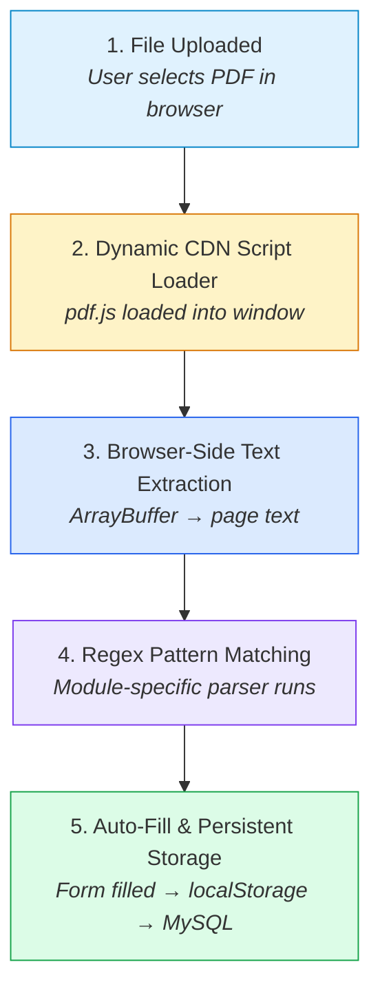
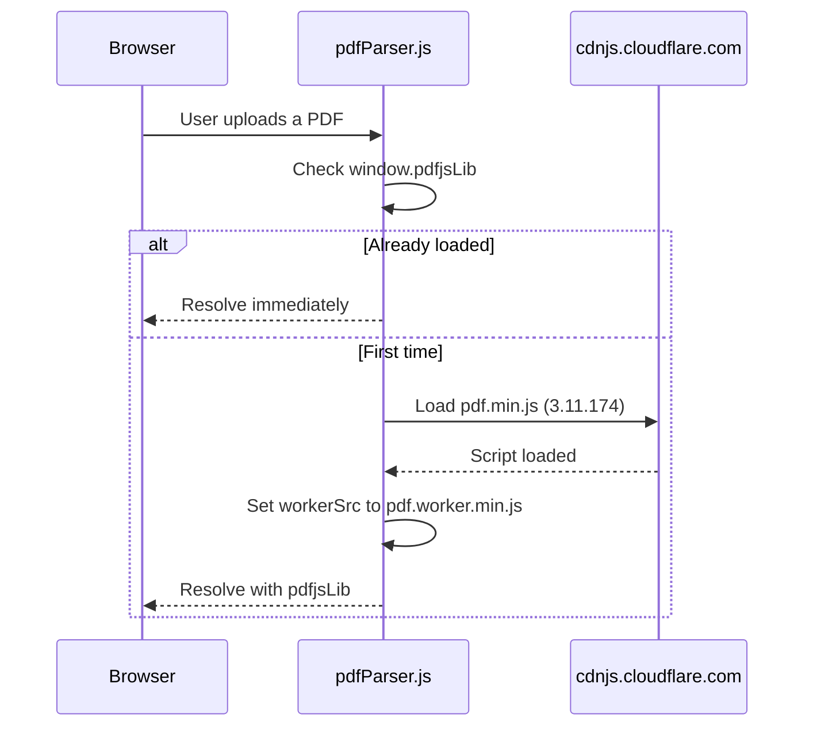
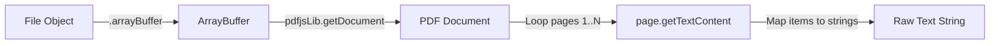
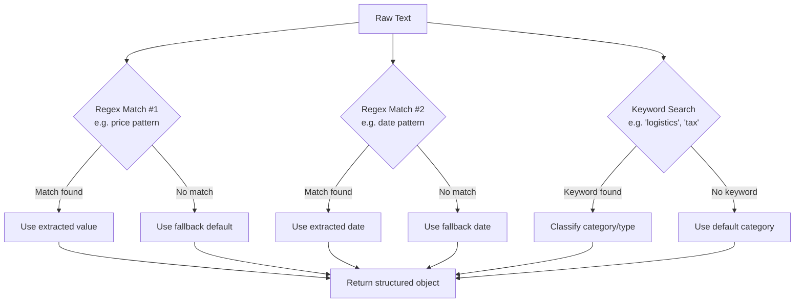
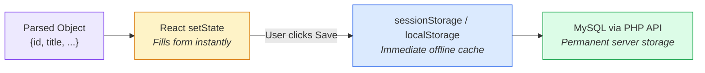
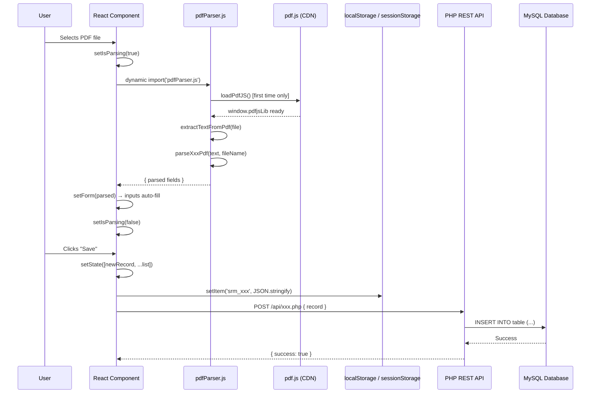

# PDF Parse Logic — SRM Portal

> **Author**: Ishan  
> **Last Updated**: 2026-05-26  
> **Core File**: [`src/utils/pdfParser.js`](../src/utils/pdfParser.js)

---

## Architecture Overview



---

## Step-by-Step Breakdown

### Step 1 — File Upload (Browser Event)

**What happens**: The user clicks the upload zone or "Choose PDF File" button inside a modal or card. A standard HTML `<input type="file" accept=".pdf">` captures the file object.

**Where it happens**:

| Module | Component File | UI Location |
|:---|:---|:---|
| RFQ Management | [`src/pages/admin/RFQManagement.jsx`](../src/pages/admin/RFQManagement.jsx) | "Create RFQ" modal → Upload zone |
| Bid Submission | [`src/pages/supplier/MyBids.jsx`](../src/pages/supplier/MyBids.jsx) | "Submit Bid Quotation" modal → Upload zone |
| Goods Receiving | [`src/pages/admin/GoodsReceiving.jsx`](../src/pages/admin/GoodsReceiving.jsx) | "Record Goods Receipt" modal → Upload zone |
| Invoice Submission | [`src/pages/supplier/Invoices.jsx`](../src/pages/supplier/Invoices.jsx) | "Submit Invoice" modal → Upload zone |
| Compliance Documents | [`src/pages/supplier/Profile.jsx`](../src/pages/supplier/Profile.jsx) | Profile page → Compliance Documents card |

**Code pattern** (identical in all 5 modules):

```jsx
<input
  type="file"
  accept=".pdf"
  onChange={handlePdfUpload}   // ← triggers the pipeline
  disabled={isParsing}
/>
```

When `onChange` fires, the handler function (`handlePdfUpload`) receives the browser `File` object and begins the pipeline.

---

### Step 2 — Dynamic CDN Script Loader

**What happens**: The `pdf.js` library (~180 KB) is loaded **on-demand** the first time a user uploads a PDF. It is **not** bundled with the application — this keeps the initial JS payload small. The library is injected as a `<script>` tag from a CDN.

**Where it happens**: [`src/utils/pdfParser.js`](../src/utils/pdfParser.js) → `loadPdfJS()` function.

**How it works**:



**Source code**:

```javascript
// src/utils/pdfParser.js — lines 2–17
export const loadPdfJS = () => {
  return new Promise((resolve, reject) => {
    if (window.pdfjsLib) {           // ← cached after first load
      resolve(window.pdfjsLib);
      return;
    }
    const script = document.createElement('script');
    script.src = 'https://cdnjs.cloudflare.com/ajax/libs/pdf.js/3.11.174/pdf.min.js';
    script.onload = () => {
      window.pdfjsLib.GlobalWorkerOptions.workerSrc =
        'https://cdnjs.cloudflare.com/ajax/libs/pdf.js/3.11.174/pdf.worker.min.js';
      resolve(window.pdfjsLib);
    };
    script.onerror = reject;
    document.head.appendChild(script);
  });
};
```

> **Why CDN instead of npm?**  
> Importing `pdfjs-dist` via npm causes Vite build errors related to missing Web Worker scripts. The CDN approach completely bypasses this, loads the worker from the same CDN, and caches it in `window.pdfjsLib` for all subsequent uploads.

---

### Step 3 — Browser-Side Text Extraction

**What happens**: The uploaded PDF file is converted to raw text entirely within the user's browser. No file is ever sent to a server for parsing.

**Where it happens**: [`src/utils/pdfParser.js`](../src/utils/pdfParser.js) → `extractTextFromPdf(file)` function.

**How it works**:



**Source code**:

```javascript
// src/utils/pdfParser.js — lines 20–37
export const extractTextFromPdf = async (file) => {
  try {
    const pdfjs = await loadPdfJS();                    // Step 2
    const arrayBuffer = await file.arrayBuffer();       // File → binary buffer
    const pdf = await pdfjs.getDocument({ data: arrayBuffer }).promise;

    let textContent = '';
    for (let i = 1; i <= pdf.numPages; i++) {           // iterate every page
      const page = await pdf.getPage(i);
      const text = await page.getTextContent();
      const pageText = text.items.map(item => item.str).join(' ');
      textContent += pageText + '\n';
    }
    return textContent;                                 // → raw string
  } catch (error) {
    console.error('PDF extraction failed, using fallback metadata parser', error);
    return '';                                          // fallback: empty → triggers defaults
  }
};
```

**Example output** (from `rfq-procurement-spec.pdf`):

```
REQUEST FOR QUOTATION RFQ-2026-LOGISTICS GLOBAL PROCUREMENT SERVICES INC.
Document Reference: RFQ-2026-LOGISTICS Issue Date: 2026-05-20
Submission Deadline: 2026-08-30 Category: Logistics Services
Estimated Value: $450,000 ...
```

---

### Step 4 — Regex Pattern Matching

**What happens**: The raw text string is fed into a **module-specific parser function** that runs targeted regular expressions and keyword lookups to extract structured data fields.

**Where it happens**: [`src/utils/pdfParser.js`](../src/utils/pdfParser.js) → one of the 5 parser functions.

Each parser follows the same internal pattern:



---

#### 4a. `parseRfqPdf(text, fileName)` — RFQ Specification Parser

**Used in**: [`RFQManagement.jsx`](../src/pages/admin/RFQManagement.jsx) (Admin Portal)

| Field | Regex / Logic | Fallback |
|:---|:---|:---|
| `title` | Derived from `fileName` (strip extension, replace `_-` with spaces, capitalize) | `'RFQ Sourcing Contract'` |
| `value` | `/(?:estimated\s+value|\bvalue\b)\s*:?\s*(\$[0-9,]+(\.[0-9]{2})?|\d+,\d{3})/i` | `'250000'` |
| `deadline` | `/\d{4}-\d{2}-\d{2}/` or `/\d{2}\/\d{2}\/\d{4}/` | `'2026-08-30'` |
| `category` | Keyword search: `logistics`→Logistics, `facility/hvac`→Facilities, `service/consulting`→Services | `'Manufacturing'` |
| `items` | Table schedule regex: `\b(\d+)\s+([A-Za-z0-9\s\(\)#\.&-]+?)\s+(\d{1,4})\s+([A-Za-z0-9/]+)\s+\$([0-9,]+)` | Parses item list from schedule table |

**Returns**: `{ title, category, deadline, value, items }`

---

#### 4b. `parseBidPdf(text, fileName)` — Bid Quotation Parser

**Used in**: [`MyBids.jsx`](../src/pages/supplier/MyBids.jsx) (Supplier Portal)

| Field | Regex / Logic | Fallback |
|:---|:---|:---|
| `rfqPackage` | `/rfq-\d+/i` | `'RFQ-24061'` |
| `price` | `/(?:total\s+bid\s+price|total\s+bid|total\s+price|\btotal\b)\s*:?\s*(\$[0-9,]+(\.[0-9]{2})?|\d+,\d{3})/i` | `120000` |
| `delivery` | `/\d+\s*(days|weeks|months)/i` | `'15 Days'` |
| `warranty` | `/\d+\s*(year|yr)/i` + append `'s'` | `'2 Years'` |

**Returns**: `{ rfqPackage, price, delivery, warranty }`

---

#### 4c. `parseGrnPdf(text, fileName)` — Goods Receipt Parser

**Used in**: [`GoodsReceiving.jsx`](../src/pages/admin/GoodsReceiving.jsx) (Admin Portal)

| Field | Regex / Logic | Fallback |
|:---|:---|:---|
| `receipt` | `/rec-\d+/i` or `/receipt\s*#?\s*\d+/i` | `'REC-' + random 4-digit` |
| `po` | `/po-\d+/i` or `/po\s*#?\s*\d+/i` | `'PO-88021'` |
| `items` | Multi-item row regex: `\b(\d+)\s+([A-Za-z0-9\s\(\)#\.-]+?)\s+(\d{1,3}(?:,\d{3})*(?:m)?)\s+(\d{1,3}(?:,\d{3})*(?:m)?)\s+(\d{1,3}(?:,\d{3})*(?:m)?)\s+(Accepted|Rejected|Pending|Review\s+required|Approved|Evaluating)\b` | Parses individual items |
| `received` | Sum of all parsed line-item received quantities | `2500` |
| `accepted` | Sum of all parsed line-item accepted quantities | `2490` |

**Returns**: `{ receipt, po, item, received, accepted }`

---

#### 4d. `parseInvoicePdf(text, fileName)` — Invoice Parser

**Used in**: [`Invoices.jsx`](../src/pages/supplier/Invoices.jsx) (Supplier Portal)

| Field | Regex / Logic | Fallback |
|:---|:---|:---|
| `id` | `/inv-\d+/i` or `/invoice\s*#?\s*\d+/i` | `'INV-' + random 54xx` |
| `po` | `/po-\d+/i` or `/po\s*#?\s*\d+/i` | `'PO-88022'` |
| `amount` | `/(?:total\s+due|total\s+amount|amount\s+due|\btotal\b)\s*:?\s*(\$[0-9,]+(\.[0-9]{2})?|\d+,\d{3})/i` | `185000` |
| `submitted` | Computed: `today` | Today's date |
| `due` | Computed: `today + 14 days` | 14 days from now |

**Returns**: `{ id, po, amount, submitted, due }`

---

#### 4e. `parseCompliancePdf(text, fileName)` — Compliance Certificate Parser

**Used in**: [`Profile.jsx`](../src/pages/supplier/Profile.jsx) (Supplier Portal)

| Field | Regex / Logic | Fallback |
|:---|:---|:---|
| `id` | `/cert-\d+/i` or `/iso-\d+/i` or `/\b\d{4,8}-\d{2}\b/` | `'CERT-' + random 6-digit` |
| `expiry` | `/\d{4}-\d{2}-\d{2}/` or `/expires\s*:\s*\d{2}\/\d{2}\/\d{4}/i` | `today + 1 year` |
| `issuer` | Keyword: `revenue/tax/irs`→IRS, `lloyd/intertek`→Intertek, `allianz/insurance`→Allianz | `'Global Certification Corp'` |
| `type` | Keyword: `tax/w9`→Tax Cert, `insurance/liability`→Liability, `14001`→ISO 14001 | `'ISO 9001'` |

**Returns**: `{ id, expiry, issuer, type }`

---

### Step 5 — Auto-Fill & Persistent Storage

**What happens**: The parsed object is used to populate the form fields in the React component's state. The record is then saved to **three layers** of persistence.



#### Layer 1 — React State (Instant UI)

The parsed fields populate form state via `setForm(...)`, immediately reflecting in the input fields:

```javascript
// Example from RFQManagement.jsx
const parsed = parseRfqPdf(text, file.name);
setForm({
  title: parsed.title,       // auto-fills "RFQ Title" input
  category: parsed.category, // auto-selects category dropdown
  deadline: parsed.deadline, // auto-fills date picker
  value: parsed.value,       // auto-fills value input
});
```

#### Layer 2 — sessionStorage & localStorage (Offline Caching)

When the user clicks "Save", the full list (including the new record) is written to cache.
* **Active User Sessions** (`srm_user`): Stored in `sessionStorage` to isolate separate browser tabs completely, enabling independent multi-account testing.
* **Transaction Records**: Written to local caches for fast rendering before database updates resolve.

#### Layer 3 — MySQL via PHP REST API (Server Persistence)

Simultaneously, a `fetch()` POST request sends the record to the PHP backend:

```javascript
// Example from RFQManagement.jsx
fetch(`${apiBaseUrl}/rfqs.php`, {
  method: 'POST',
  headers: { 'Content-Type': 'application/json' },
  body: JSON.stringify(newRfq),
});
```

| Module | API Endpoint | DB Table |
|:---|:---|:---|
| RFQs | `backend/api/rfqs.php` | `rfqs` |
| Bids | `backend/api/bids.php` | `bids` |
| Goods Receipts | `backend/api/receipts.php` | `goods_receipts` |
| Invoices | `backend/api/invoices.php` | `invoices` |
| Compliance Docs | `backend/api/compliance.php` | `compliance_documents` |

On page load, a `useEffect` hook fetches the latest records from the API. If the API is unreachable, the component gracefully falls back to cached data.

---

## Complete Data Flow (End-to-End)



---

## UI Layout Sizing & Verification Window Behavior

To present a professional interface, the verification modals dynamically resize depending on whether a PDF preview is active, ensuring optimal horizontal alignment:

| Component | Standard Width (No PDF) | Split-Screen Width (With PDF) | Justification |
| :--- | :--- | :--- | :--- |
| **RFQ Sourcing** (`RFQManagement.jsx`) | `lg` (`max-w-3xl` / 768px) | `xxl` (`max-w-7xl` / 1280px) | Spacious input layout; wide side-by-side view |
| **Supplier Bids** (`MyBids.jsx`) | `lg` (`max-w-3xl` / 768px) | `xxl` (`max-w-7xl` / 1280px) | Wide inputs for pricing & warranty; clear side-by-side |
| **Goods Receiving** (`GoodsReceiving.jsx`) | `xl` (`max-w-5xl` / 1024px) | `xxl` (`max-w-7xl` / 1280px) | Standard layout uses `xl` to fit the multi-item line table |
| **Supplier Invoices** (`Invoices.jsx`) | `lg` (`max-w-3xl` / 768px) | `xxl` (`max-w-7xl` / 1280px) | Prevents narrow stacked inputs; clean billing side-by-side |
| **Supplier Profile** (`Profile.jsx`) | `lg` (`max-w-3xl` / 768px) | `xxl` (`max-w-7xl` / 1280px) | Comfortable certificate form; wide certificate display |

When `pdfBlobUrl` is truthy, the grid structure inside the modal changes:
- `pdfBlobUrl` is falsy: Form renders in a single-column layout centered at standard width.
- `pdfBlobUrl` is truthy: Grid changes to `md:grid-cols-2`, with the left half rendering the form inputs, and the right half displaying the interactive PDF `iframe`.

---

## Sample PDF Documents

Each module has a downloadable, industry-standard sample PDF pre-loaded with matching tokens that the parser will successfully extract:

| Module | Sample PDF | Key Extractable Tokens |
|:---|:---|:---|
| RFQ Management | [`rfq-procurement-spec.pdf`](../public/samples/rfq-procurement-spec.pdf) | `$450,000` · `2026-08-30` · `Logistics` · filename → title |
| Bid Submission | [`bid-quotation.pdf`](../public/samples/bid-quotation.pdf) | `RFQ-24061` · `$125,000` · `12 days` · `3 years` |
| Goods Receiving | [`delivery-receipt.pdf`](../public/samples/delivery-receipt.pdf) | `REC-9081` · `PO-88021` · `valve` keyword · `1500` qty |
| Invoice | [`supplier-invoice.pdf`](../public/samples/supplier-invoice.pdf) | `INV-5401` · `PO-88021` · `$185,000` |
| Compliance | [`iso-compliance-certificate.pdf`](../public/samples/iso-compliance-certificate.pdf) | `CERT-8401185` · `2027-05-26` · `Intertek` · `ISO 9001` |

---

## Fallback Protection Summary

If a PDF is **scanned** (image-based, no selectable text), **encrypted**, or simply does not contain matching regex patterns, the parser **never leaves fields blank**. Every regex match has a hardcoded fallback:

```
Regex Match Found?
  ├── YES → Use extracted value
  └── NO  → Use sensible default (e.g. $250,000 / 15 Days / ISO 9001)
```

This guarantees the form is always fully populated, providing a smooth user experience regardless of PDF quality.
